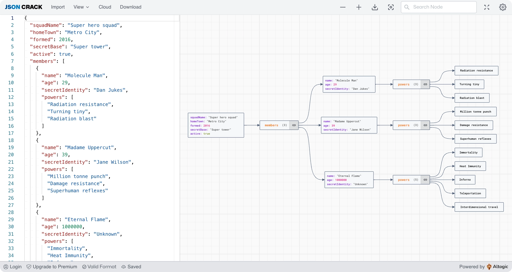

<a href="https://jsoncrack.com/" target="_blank" rel="noopener">
    
</a>


<h4 align="center">
  <a href="https://jsoncrack.com">JSON Crack</a> |
  <a href="https://marketplace.visualstudio.com/items?itemName=AykutSarac.jsoncrack-vscode">VS Code Extension</a> |
  <a href="https://jsoncrack.com/docs">Documentation</a> |
  <a href="https://editor.herowand.com">Herowand Editor</a>
</h4>

<div align="center">
  <h2>
    An innovative, open source JSON visualization app.
    <br />
    Brings data to life through captivating graphs.
  </h2>
</div>

<br />
<p align="center">
  <a href="https://www.producthunt.com/posts/json-crack?utm_source=badge-featured&utm_medium=badge&utm_souce=badge-json&#0045;crack" target="_blank"></a>
    <a href="https://discord.gg/yVyTtCRueq" target="_blank"></a>
    </br>
    <a href="https://github.com/sponsors/AykutSarac" target="_blank"></a>
  </p>

<p align="center">
  
</p>

# JSON Crack (jsoncrack.com)

JSON Crack is a free, open-source JSON visualization app that will revolutionize the way you work with data. With its intuitive and user-friendly interface, JSON Crack makes it easy to explore, analyze, and understand even the most complex JSON structures. Whether you're a developer working on a large-scale project or a data enthusiast looking to uncover hidden insights, JSON Crack has the tools and features you need to unlock the full potential of your data.

## Features
- 💯 Free & open-source.
- 🌓 Dark mode.
- 🖼️ Export to PNG, SVG & clipboard.
- 🔍 Zoom and panning support.
- 🛠 Wide range of tools - search, json path, node contents, expand/toggle, auto format...
- 🔗 Share/Import/Fetch
- 🧱 Embeddable iframe widgets.

## Contributing

- Missing something or found a bug? [Report here](https://github.com/AykutSarac/jsoncrack.com/issues).
- Want to contribute? Check out our [contribution guide](https://github.com/AykutSarac/jsoncrack.com/blob/main/CONTRIBUTING.md) or let us know on [Discord](https://discord.gg/yVyTtCRueq).

## Sponsors & support

If you like the project, you can become a sponsor at [GitHub Sponsors](https://github.com/sponsors/AykutSarac) or use [Herowand Editor](https://editor.herowand.com/).

## Docker

🐳 A [`Dockerfile`](Dockerfile) is provided in the root of the repository.
If you want to run JSON Crack locally:

```console
# Build a Docker image with:
docker build -t jsoncrack .

# Run locally with:
docker run -p 8888:8080 jsoncrack

# Go to http://localhost:8888
```

## Thank you for supporting JSON Crack

Last but not least, we're thankful to these companies for offering their services for free:

<a href="https://altogic.com">
  
</a>
<a href="https://sentry.io">
  
</a>
