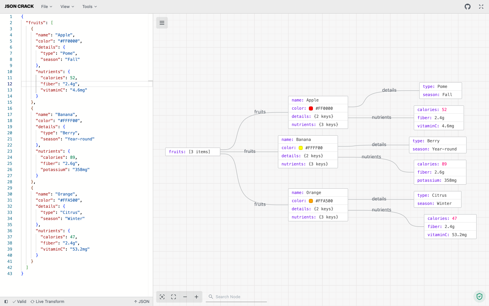

<!-- PROJECT LOGO -->
<p align="center">
  <a href="https://github.com/AykutSarac/jsoncrack.com">
   
  </a>

  <h1 align="center">JSON Crack</h1>

  <p align="center">
    The open-source JSON Editor.
    <br />
    <a href="https://jsoncrack.com"><strong>Learn more »</strong></a>
    <br />
    <br />
    <a href="https://todiagram.com">ToDiagram</a>
    ·
    <a href="https://discord.gg/yVyTtCRueq">Discord</a>
    ·
    <a href="https://jsoncrack.com">Website</a>
    ·
    <a href="https://github.com/AykutSarac/jsoncrack.com/issues">Issues</a>
    ·
    <a href="https://marketplace.visualstudio.com/items?itemName=AykutSarac.jsoncrack-vscode">VS Code</a>
  </p>
</p>

<!-- ABOUT THE PROJECT -->

## About the Project



## Visualize JSON into interactive graphs

JSON Crack is a tool for visualizing JSON data in a structured, interactive graphs, making it easier to explore, format, and validate JSON. It offers features like converting JSON to other formats (CSV, YAML), generating JSON Schema, executing queries, and exporting visualizations as images. Designed for both readability and usability.

* **Visualizer**: Instantly convert JSON, YAML, CSV, XML, and TOML into interactive graphs or trees in dark or light mode.
* **Convert**: Seamlessly transform data formats, like JSON to CSV or XML to JSON, for easy sharing.
* **Format & Validate**: Beautify and validate JSON, YAML, and CSV for clear and accurate data.
* **Code Generation**: Generate TypeScript interfaces, Golang structs, and JSON Schema.
* **JSON Schema**: Create JSON Schema, mock data, and validate various data formats.
* **Advanced Tools**: Decode JWT, randomize data, and run jq or JSON path queries.
* **Export Image**: Download your visualization as PNG, JPEG, or SVG.
* **Privacy**: All data processing is local; nothing is stored on our servers.

## Recognition

<a href="https://news.ycombinator.com/item?id=32626873">
  
</a>

<a href="https://producthunt.com/posts/JSON-Crack?utm_source=badge-featured&utm_medium=badge&utm_souce=badge-jsoncrack" target="_blank"></a>

### Built With

- [Next.js](https://nextjs.org/?ref=jsoncrack.com)
- [React.js](https://reactjs.org/?ref=jsoncrack.com)
- [Reaflow](https://reaflow.dev/?ref=jsoncrack.com)
- [Monaco Editor](https://github.com/suren-atoyan/monaco-react)

## Stay Up-to-Date

JSON Crack officially launched as v1.0 on the 17th of February 2022 and we've come a long way so far. Watch **releases** of this repository to be notified of future updates:

<a href="https://github.com/AykutSarac/jsoncrack.com"></a>

<!-- GETTING STARTED -->

## Getting Started

To get a local copy up and running, please follow these simple steps.

### Prerequisites

Here is what you need to be able to run JSON Crack.

- Node.js (Version: >=18.x)
- Pnpm _(recommended)_


## Development

### Setup

1. Clone the repo into a public GitHub repository (or fork https://github.com/AykutSarac/jsoncrack.com/fork). If you plan to distribute the code, read the [`LICENSE`](/LICENSE.md) for additional details.

   ```sh
   git clone https://github.com/AykutSarac/jsoncrack.com.git
   ```

2. Go to the project folder

   ```sh
   cd jsoncrack.com
   ```

3. Install packages

   ```sh
   pnpm install
   ```

4. Run the project

   ```sh
   pnpm dev

   # Running on http://localhost:3000/
   ```

### Docker

 🐳 A [`Dockerfile`](Dockerfile) is provided in the root of the repository.
If you want to run JSON Crack locally:

```console
# Build a Docker image with:
docker compose build

# Run locally with `docker-compose`
docker compose up

# Go to http://localhost:8888
```

<!-- LICENSE -->

## License

See [`LICENSE`](/LICENSE.md) for more information.
