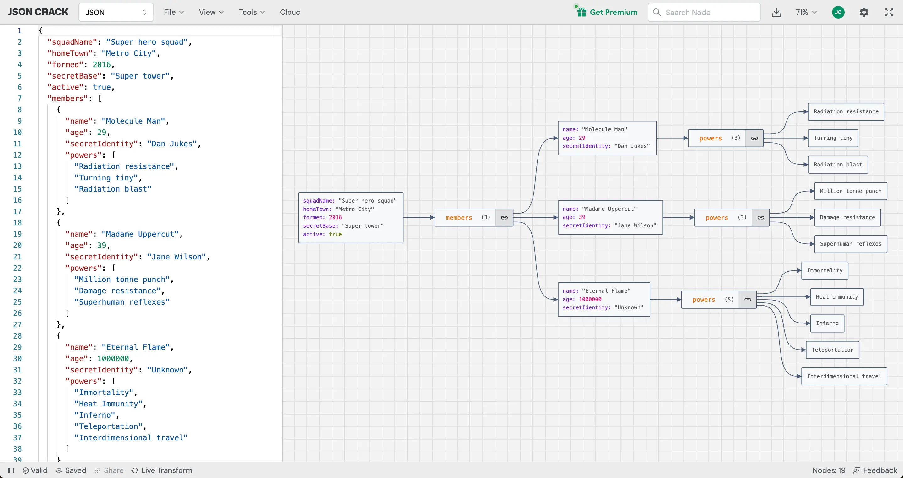

<!-- PROJECT LOGO -->
<p align="center">
  <a href="https://github.com/AykutSarac/jsoncrack.com">
   
  </a>

  <h1 align="center">JSON Crack</h1>

  <p align="center">
    The open-source JSON Editor.
    <br />
    <a href="https://jsoncrack.com"><strong>Learn more »</strong></a>
    <br />
    <br />
    <a href="https://todiagram.com">ToDiagram</a>
    ·
    <a href="https://discord.gg/yVyTtCRueq">Discord</a>
    ·
    <a href="https://jsoncrack.com">Website</a>
    ·
    <a href="https://github.com/AykutSarac/jsoncrack.com/issues">Issues</a>
    ·
    <a href="https://marketplace.visualstudio.com/items?itemName=AykutSarac.jsoncrack-vscode">VS Code</a>
  </p>
</p>

<!-- ABOUT THE PROJECT -->

## About the Project



## Visualize JSON into interactive graphs

JSON Crack is a free, open-source data visualization app capable of visualizing data formats such as JSON, YAML, XML, CSV and more, into interactive graphs. With its intuitive and user-friendly interface, JSON Crack makes it easy to explore, analyze, and understand even the most complex data structures. Whether you're a developer working on a large-scale project or a data enthusiast looking to uncover hidden insights, JSON Crack has the tools and features you need to unlock the full potential of your data.

- **Visualizer/Viewer**: Transform your data into interactive graphs or trees as you type in dark & light modes. Supports JSON, YAML, CSV, XML, and TOML.
- **Convert**: Convert JSON to CSV, YAML to JSON, XML to JSON, and more. Our JSON converter supports multiple formats for easy data exchange.
- **Format & Validate**: Format and beautify your JSON data to make it more readable. Validate JSON, YAML, and CSV.
- **Generate Code**: Generate TypeScript interface, Golang structs, JSON Schema and more.
- **JSON Schema**: Generate JSON Schema, create mock data, and validate JSON Schema from various data formats like JSON, YAML, XML, and CSV.
- **Advanced JSON Tools**: Decode JWT, randomize data, execute jq (JSON Query), json path commands.
- **Download Image**: Export image of the graph as PNG, JPEG, or SVG. Share your data visualization with others.
- **Secure**: Your data is never stored on our servers. Everything happens on your device.

## Recognition

<a href="https://news.ycombinator.com/item?id=32626873">
  
</a>

<a href="https://producthunt.com/posts/JSON-Crack?utm_source=badge-featured&utm_medium=badge&utm_souce=badge-jsoncrack" target="_blank"></a>

### Built With

- [Next.js](https://nextjs.org/?ref=jsoncrack.com)
- [React.js](https://reactjs.org/?ref=jsoncrack.com)
- [Supabase](https://supabase.com/?ref=jsoncrack.com)
- [Reaflow](https://reaflow.dev/?ref=jsoncrack.com)
- [Monaco Editor](https://github.com/suren-atoyan/monaco-react)

## Stay Up-to-Date

JSON Crack officially launched as v1.0 on the 17th of February 2022 and we've come a long way so far. Watch **releases** of this repository to be notified of future updates:

<a href="https://github.com/AykutSarac/jsoncrack.com"></a>

<!-- GETTING STARTED -->

## Getting Started

To get a local copy up and running, please follow these simple steps.

### Prerequisites

Here is what you need to be able to run JSON Crack.

- Node.js (Version: >=18.x)
- Pnpm _(recommended)_


## Development

### Setup

1. Clone the repo into a public GitHub repository (or fork https://github.com/AykutSarac/jsoncrack.com/fork). If you plan to distribute the code, read the `LICENSE` for additional details.

   ```sh
   git clone https://github.com/AykutSarac/jsoncrack.com.git
   ```

2. Go to the project folder

   ```sh
   cd jsoncrack.com
   ```

3. Install packages with yarn

   ```sh
   pnpm install
   ```

4. Run the project

   ```sh
   pnpm dev

   # Running on http://localhost:3000/
   ```

### Docker

 🐳 A [`Dockerfile`](Dockerfile) is provided in the root of the repository.
If you want to run JSON Crack locally:

```console
# Build a Docker image with:
docker build -t jsoncrack .

# Run locally with `docker run`
docker run -p 8888:8080 jsoncrack

# Run locally with `docker-compose`
docker-compose up -d

# Go to http://localhost:8888
```

<!-- CONTRIBUTING -->

## Contributing

Please see our [contributing guide](/CONTRIBUTING.md).

### Good First Issues

We have a list of [help wanted](https://github.com/AykutSarac/jsoncrack.com/issues?q=is:issue+is:open+label:%22%F0%9F%99%8B%F0%9F%8F%BB%E2%80%8D%E2%99%82%EF%B8%8Fhelp+wanted%22) that contain small features and bugs which have a relatively limited scope. This is a great place to get started, gain experience, and get familiar with our contribution process.

<!-- CONTRIBUTORS -->

### Contributors

<a href="https://github.com/AykutSarac/jsoncrack.com/graphs/contributors">
  
</a>

<!-- LICENSE -->

## License

See `LICENSE` for more information.
