# Projektarbeit Web Application Testing - Dokumentation

**Webanwendung:** JSON Crack (https://jsoncrack.com/)

---

## Inhaltsverzeichnis

1. [Die getestete Webanwendung](#1-die-getestete-webanwendung)
2. [Test-Setup im Überblick](#2-test-setup-im-überblick)
3. [Test-Frameworks](#3-test-frameworks)
4. [Test-Ausführung](#4-test-ausführung)
5. [Test-Isolation](#5-test-isolation)
6. [Load Tests](#6-load-tests)
7. [KI Nutzung](#7-ki-nutzung)

---

## 1. Die getestete Webanwendung

[**JSON Crack**](https://jsoncrack.com) ist ein Open Source Editor, der JSON, YAML, CSV, XML in 
Graphen und Bäume visualisieren kann. Die Anwendung läuft komplett als Frontend Anwendung ohne Backend.

### Technologie-Stack

| Bereich            | Technologie                                                        |
| ------------------ | ------------------------------------------------------------------ |
| Sprache            | TypeScript                                                         |
| Framework          | Next.js 16 (React 19)                                              |
| State Management   | Zustand (Stores `useFile`, `useJson`, `useConfig`, `useModal`)     |
| UI                 | Mantine, styled-components                                         |
| Editor             | Monaco Editor                                                      |
| Graph-Rendering    | reaflow / react-zoomable-ui                                        |
| Daten-Parser       | `jsonc-parser`, `js-yaml`, `fast-xml-parser`, `json-2-csv`         |
| Tools (WASM)       | `jq-web`, `json_typegen_wasm`, `gofmt.js`                          |
| Monorepo           | Turborepo + pnpm-Workspaces                                        |

Das Repository enthält drei Teile: `apps/www`, `apps/vscode`, `apps/chrome-extension`. Die
Webanwendung liegt in `apps/www` und dort hat es vorher keine Tests gegeben. 

---

## 2. Test-Setup

Sämtliche Tests liegen in `apps/www/src/__tests__/`:

```
apps/www/src/__tests__/
├── json-adapater.test.ts            # Unit Test (Format-Konvertierung)
├── json2go.test.ts                  # Unit Test (JSON -> Go struct)
├── useFile.integration.test.ts      # Integration Test (Zusammenspiel useFile und useJson)
├── useJsonQuery.integration.test.ts # Integration Test (jq Abfrage Hook und Typegen Hook)
├── e2e/
│   ├── editor.e2e.ts                # E2E Test (Editor und Graph Visualisierung)
│   ├── tools.e2e.ts                 # E2E Test (JSON Path und JSON-Schema)
│   └── fixtures/                    # Wiederverwendbare Testdaten
│       ├── sampleJson.ts
│       ├── jsonPath.ts
│       └── jsonSchema.ts
└── load/
    ├── editor.load.js               # Load Test (Spike Test)
    └── loadbalancer/
        ├── editor.lb.load.js        # Load Test (Ramp Up Test mit Load Balancer)
        ├── docker-compose.loadtest.yml  # (Web Replikas + nginx + k6)
        └── lb.nginx.conf                # (Load Balancer Konfiguration)
```

### Wer welchen Test erstellt hat

| Datei                                 | Art         | Anzahl der Tests | Autor            |
| ------------------------------------- | ----------- |:----------------:| ---------------- |
| `json-adapater.test.ts`               | Unit        |        13        | Stefan Czepl     |
| `useFile.integration.test.ts`         | Integration |        4         | Stefan Czepl     |
| `e2e/editor.e2e.ts`                   | E2E         |        3         | Stefan Czepl     |
| `load/editor.load.js`                 | Load        |        1         | Stefan Czepl     |
| `json2go.test.ts`                     | Unit        |        13        | Fabian Eberhardt |
| `useJsonQuery.integration.test.ts`    | Integration |        4         | Fabian Eberhardt |
| `e2e/tools.e2e.ts`                    | E2E         |        2         | Fabian Eberhardt |
| `load/loadbalancer/editor.lb.load.js` | Load        |        1         | Fabian Eberhardt |

---

## 3. Test-Frameworks

| Ebene       | Framework            |
|-------------|----------------------|
| Unit        | Jest                 |
| Integration | Jest                 |
| E2E         | Playwright           |
| Load        | k6 (+ Docker, nginx) |

---

## 4. Test-Ausführung

Alle Befehle müssen in `apps/www` ausgeführt werden.

### Unit und Integration Tests (Jest)

```bash
pnpm --filter www test
pnpm test
```

### E2E Tests (Playwright)

```bash
pnpm --filter www test:e2e      # startet den server automatisch
pnpm --filter www test:e2e:ui   # ui modus
pnpm --filter www test:e2e:report  # html report vom letztn test run
```

### Testergebnisse

Unit Tests

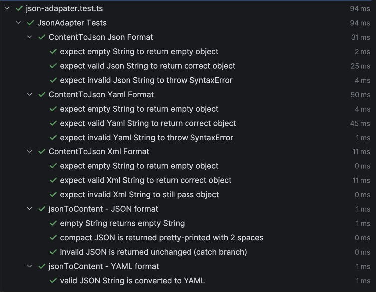

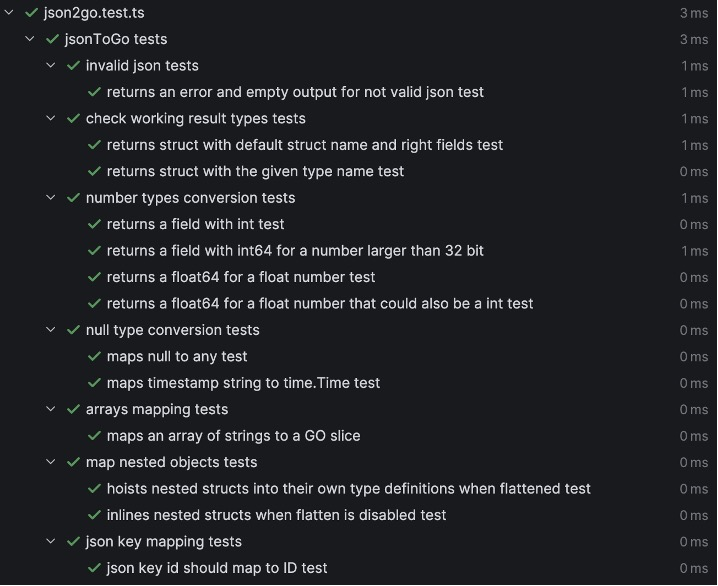

Integration Tests

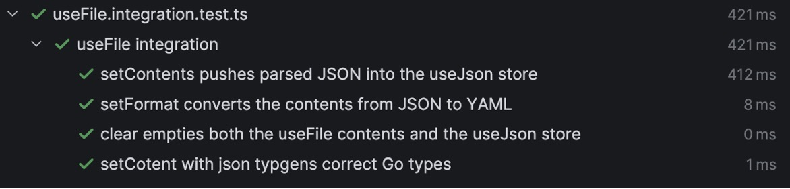

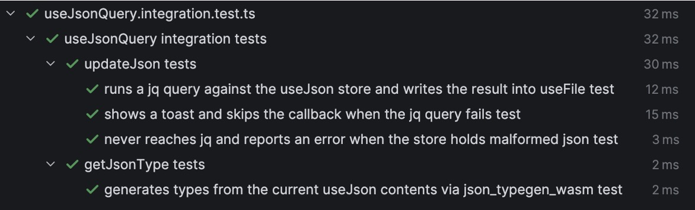

E2E-Tests

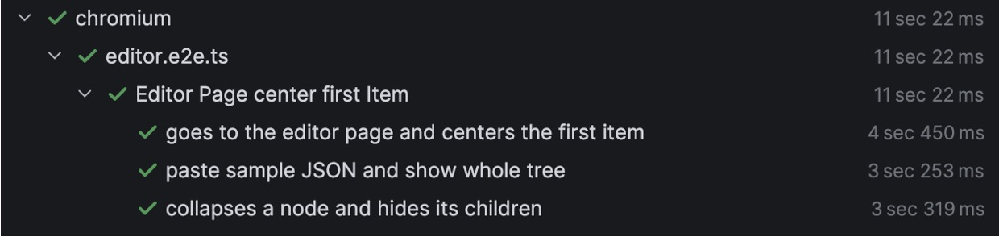

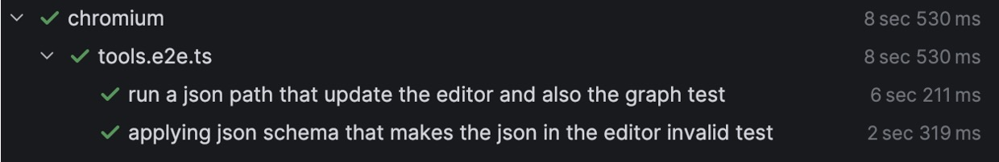

---

## 5. Test Isolation

- Integration: In `beforeEach` und `afterEach` wird alles wieder zurückgesetzt, so das alle Test unabhängig voneinander sind.
- E2E: Bei den Playwright Test hat durch Playwright jeder Test einen frischen Browser-Kontext (eigene Cookies/Storage).
  In den `test.beforeEach` Blöcken wird wieder zum Startpunkt navigiert. Außerdem ist das parallele Ausführen deaktiviert.

---

## 6. Load Tests

Für die Lasttests verwenden wir k6.

### 6.1 Spike Test `load/editor.load.js` (Stefan Czepl)

Dieser Load Test verwendet den Lokal laufenden Server:

```bash
pnpm --filter www dev                       # server starten
k6 run src/__tests__/load/editor.load.js    # load test starten
```

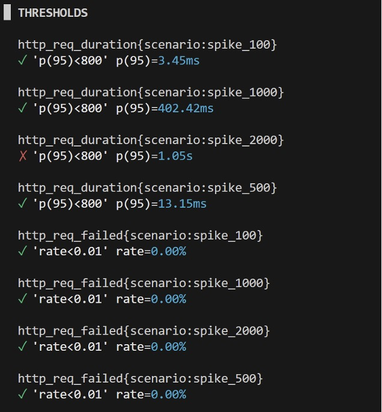

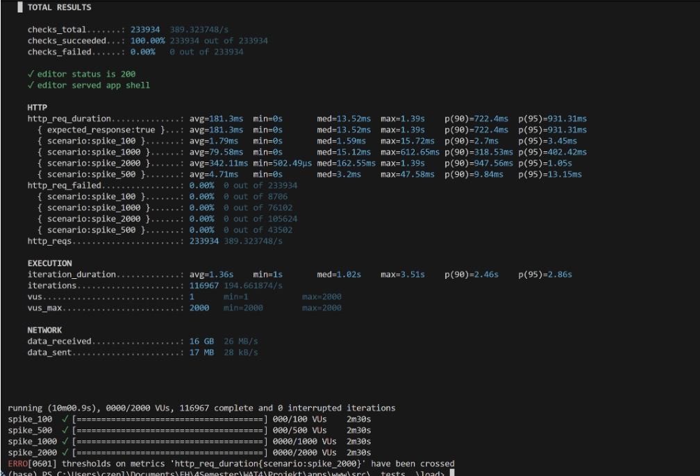

### 6.2 Ramp up Test `load/loadbalancer/editor.lb.load.js` (Fabian Eberhardt)

Für diesen Load Test werden mehrere Web Server verwendet:

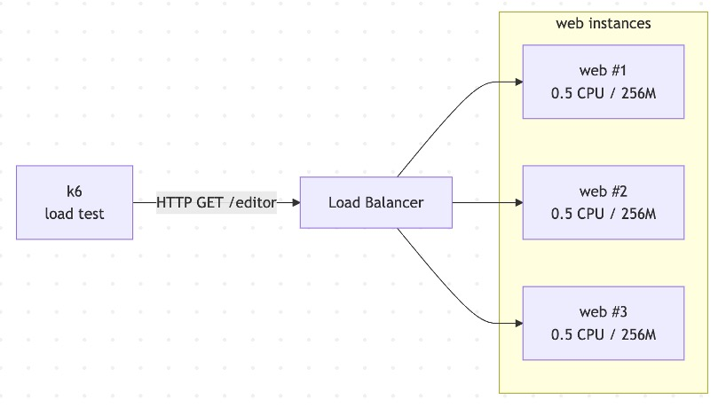

Ausführung mit Docker in `apps/www`:

```bash
docker compose -f src/__tests__/load/loadbalancer/docker-compose.loadtest.yml \
  up --build --scale web=3 --abort-on-container-exit --exit-code-from k6
```

Verwendete Load Balancer Konfiguration:

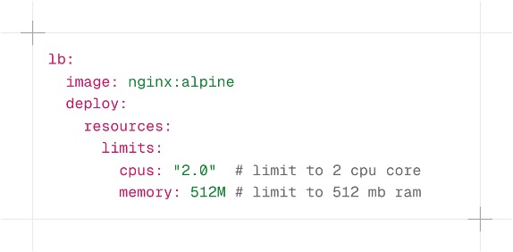

1 Web Container

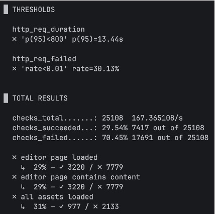

3 Web Container

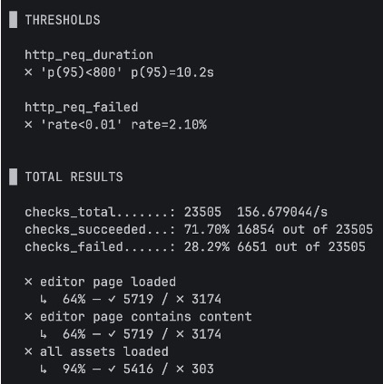

5 Web Container

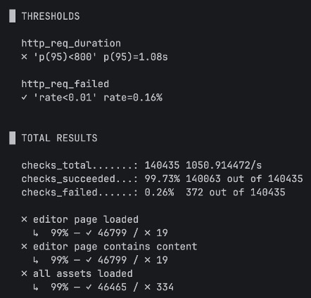

10 Web Container

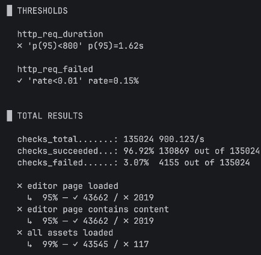

Angepasste Load Balancer Konfiguration für den letzten Load Test:

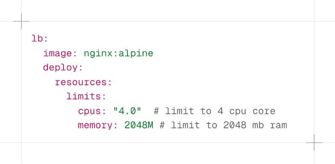

Mit 10 Web Containers und den angepassten Load Balancer Konfiguration:

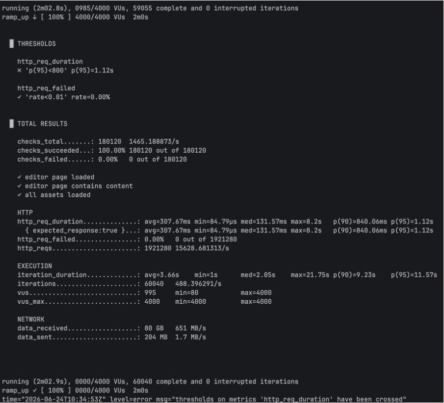

---

## 7. KI Nutzung

Wir haben Claude Code (Opus 4.8) eingesetzt.Es hat beim Erstellen der
Tests geholfen, aber eher in einem Fragemodus und nicht generiere mir den folgenden Test/Code.
Auch hat es dabei geholfen wie man bestimmte Funktionen/Teile am besten testen kann 
und welche Funktionen das jeweilige Testframework dafür hat (z.B. wie man Abhängigkeiten mocken kann). 
Außerdem hat es uns beim Erstellen der Markdown Dokumentation geholfen. Die inhaltlichen
Entscheidungen haben wir selbst getroffen und alle generierten Inhalte vor dem akzeptieren geprüft.