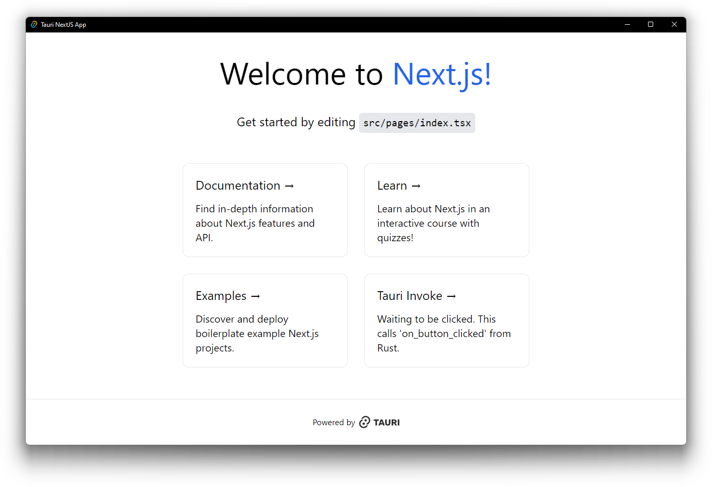

# Tauri + Next.js Template



This is a [Tauri](https://tauri.app/) project template using [Next.js](https://nextjs.org/),
bootstrapped by combining [`create-next-app`](https://github.com/vercel/next.js/tree/canary/packages/create-next-app)
and [`create tauri-app`](https://tauri.app/v1/guides/getting-started/setup).

This template uses [`pnpm`](https://pnpm.io/) as the Node.js dependency
manager.

## Template Features

- TypeScript frontend using Next.js React framework
- [TailwindCSS](https://tailwindcss.com/) as a utility-first atomic CSS framework
  - The example page in this template app has been updated to use only TailwindCSS
  - While not included by default, consider using
    [React Aria components](https://react-spectrum.adobe.com/react-aria/index.html)
    and/or [HeadlessUI components](https://headlessui.com/) for completely unstyled and
    fully accessible UI components, which integrate nicely with TailwindCSS
- Opinionated formatting and linting already setup and enabled
  - [ESLint](https://eslint.org/) for pure React + TypeScript linting, and
    [Biome](https://biomejs.dev/) for a combination of fast formatting, linting, and
    import sorting of JavaScript and TypeScript code
  - [clippy](https://github.com/rust-lang/rust-clippy) and
    [rustfmt](https://github.com/rust-lang/rustfmt) for Rust code
- GitHub Actions to check code formatting and linting for both TypeScript and Rust

## Getting Started

### Running development server and use Tauri window

After cloning for the first time, set up git pre-commit hooks:

```shell
pnpm prepare
```

To develop and run the frontend in a Tauri window:

```shell
pnpm dev
```

This will load the Next.js frontend directly in a Tauri webview window, in addition to
starting a development server on `localhost:3000`.

### Building for release

To export the Next.js frontend via SSG and build the Tauri application for release:

```shell
pnpm build
```

Please remember to change the bundle identifier in
`tauri.conf.json > tauri > bundle > identifier`, as the default value will yield an
error that prevents you from building the application for release.

### Source structure

Next.js frontend source files are located in `src/` and Tauri Rust application source
files are located in `src-tauri/`. Please consult the Next.js and Tauri documentation
respectively for questions pertaining to either technology.

## Caveats

### Static Site Generation / Pre-rendering

Next.js is a great React frontend framework which supports server-side rendering (SSR)
as well as static site generation (SSG or pre-rendering). For the purposes of creating a
Tauri frontend, only SSG can be used since SSR requires an active Node.js server.

Using Next.js and SSG helps to provide a quick and performant single-page-application
(SPA) frontend experience. More information regarding this can be found here:
https://nextjs.org/docs/basic-features/pages#pre-rendering

### `next/image`

The [`next/image` component](https://nextjs.org/docs/basic-features/image-optimization)
is an enhancement over the regular `` HTML element with additional optimizations
built in. However, because we are not deploying the frontend onto Vercel directly, some
optimizations must be disabled to properly build and export the frontend via SSG.
As such, the
[`unoptimized` property](https://nextjs.org/docs/api-reference/next/image#unoptimized)
is set to true for the `next/image` component in the `next.config.js` configuration.
This will allow the image to be served as-is from source, without
changes to its quality, size, or format.

### error[E0554]: `#![feature]` may not be used on the stable release channel

If you are getting this issue when trying to run `pnpm tauri dev`, it may be that you
have a newer version of a Rust dependency that uses an unstable feature.
`pnpm tauri build` should still work for production builds, but to get the dev command
working, either downgrade the dependency or use Rust nightly via
`rustup override set nightly`.

### ReferenceError: navigator is not defined

If you are using Tauri's `invoke` function or any OS related Tauri function from within
JavaScript, you may encounter this error when importing the function in a global,
non-browser context. This is due to the nature of Next.js' dev server effectively
running a Node.js server for SSR and hot module replacement (HMR), and Node.js does not
have a notion of `window` or `navigator`.

#### Solution 1 - Dependency Injection (may not always work)

Make sure that you are calling these functions within the browser context, e.g. within a
React component inside a `useEffect` hook when the DOM actually exists by then. If you
are trying to use a Tauri function in a generalized utility source file, a workaround is
to use dependency injection for the function itself to delay the actual importing of the
real function (see example below for more info).

Example using Tauri's `invoke` function:

`src/lib/some_tauri_functions.ts` (problematic)

```typescript
// Generalized file containing all the invoke functions we need to fetch data from Rust
import { invoke } from "@tauri-apps/api/tauri"

const loadFoo = (): Promise<string> => {
  return invoke<string>("invoke_handler_foo")
}

const loadBar = (): Promise<string> => {
  return invoke<string>("invoke_handler_bar")
}

const loadBaz = (): Promise<string> => {
  return invoke<string>("invoke_handler_baz")
}

// and so on ...
```

`src/lib/some_tauri_functions.ts` (fixed)

```typescript
// Generalized file containing all the invoke functions we need to fetch data from Rust
//
// We apply the idea of dependency injection to use a supplied invoke function as a
// function argument, rather than directly referencing the Tauri invoke function.
// Hence, don't import invoke globally in this file.
//
// import { invoke } from "@tauri-apps/api/tauri"  <-- remove this!
//

import { InvokeArgs } from "@tauri-apps/api/tauri"
type InvokeFunction = <T>(cmd: string, args?: InvokeArgs | undefined) => Promise<T>

const loadFoo = (invoke: InvokeFunction): Promise<string> => {
  return invoke<string>("invoke_handler_foo")
}

const loadBar = (invoke: InvokeFunction): Promise<string> => {
  return invoke<string>("invoke_handler_bar")
}

const loadBaz = (invoke: InvokeFunction): Promise<string> => {
  return invoke<string>("invoke_handler_baz")
}

// and so on ...
```

Then, when using `loadFoo`/`loadBar`/`loadBaz` within your React components, import the
invoke function from `@tauri-apps/api` and pass `invoke` into the loadXXX function as
the `InvokeFunction` argument. This should allow the actual Tauri API to be bundled
only within the context of a React component, so it should not be loaded by Next.js upon
initial startup until the browser has finished loading the page.

#### Solution 2: Wrap Tauri API behind dynamic `import()`

Since the Tauri API needs to read from the browser's `window` and `navigator` object,
this data does not exist in a Node.js and hence SSR environment. One can create an
exported function that wraps the Tauri API behind a dynamic runtime `import()` call.

Example: create a `src/lib/tauri.ts` to re-export `invoke`

```typescript
import type { InvokeArgs } from "@tauri-apps/api/tauri"

const isNode = (): boolean =>
  Object.prototype.toString.call(typeof process !== "undefined" ? process : 0) ===
  "[object process]"

export async function invoke<T>(
  cmd: string,
  args?: InvokeArgs | undefined,
): Promise<T> {
  if (isNode()) {
    // This shouldn't ever happen when React fully loads
    return Promise.resolve(undefined as unknown as T)
  }
  const tauriAppsApi = await import("@tauri-apps/api")
  const tauriInvoke = tauriAppsApi.invoke
  return tauriInvoke(cmd, args)
}
```

Then, instead of importing `import { invoke } from "@tauri-apps/api/tauri"`, use invoke
from `import { invoke } from "@/lib/tauri"`.

## Learn More

To learn more about Next.js, take a look at the following resources:

- [Next.js Documentation](https://nextjs.org/docs) - learn about Next.js features and
  API.
- [Learn Next.js](https://nextjs.org/learn) - an interactive Next.js tutorial.

And to learn more about Tauri, take a look at the following resources:

- [Tauri Documentation - Guides](https://tauri.app/v1/guides/) - learn about the Tauri
  toolkit.
